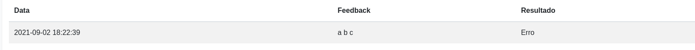
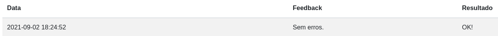

## Login 
First, you need to login using your organization username as both username and password.

Then, you will need to change your password by clicking on the top left button. Next, put your current password and your new one in the form and submit. 

## Submitting your code

To submit your code, click on the designated quiz and upload your code and send it. It's as simple as that. Your feedback will be displayed beside your entry row. 

If your code failed, it will appear like this:

If it passed all the test, it will show this:

