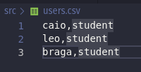
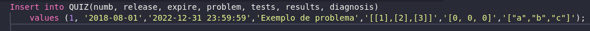

## Adding students

To add students, first you need to create a CSV file named "users.csv" with their names and roles:

Adding users to the database:

`$ python3 adduser.py`

## Adding new quizzes

To add quizzes, you will have to manually insert the quiz in the database with a SQL script.

Example of a SQL query adding a quiz:

